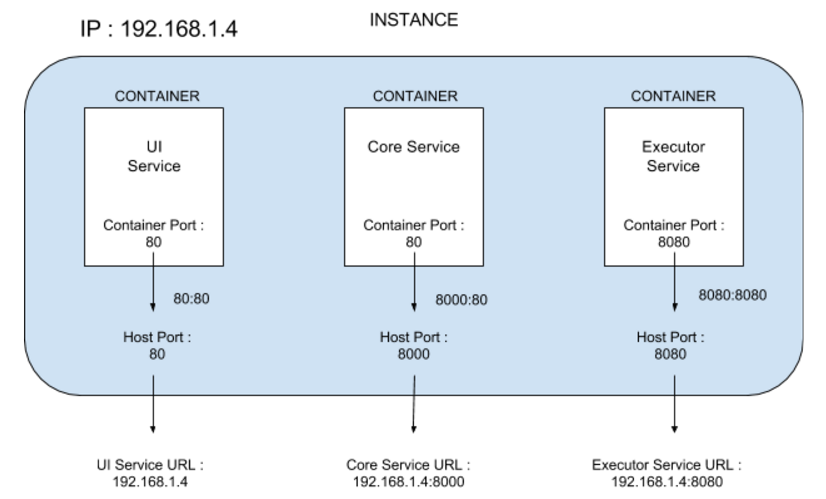

# Download and Install CloudMunch services

## Before you begin

Basic understanding of docker, container, images, compose etc. are required in order to complete the below steps.

## Prerequisites

#### If installing docker on Windows or Mac 
* download docker-tools from [here](https://www.docker.com/products/docker-toolbox) and install

#### Create user and group with name cloudmunch and id 580
####  Install Docker 1.10

* Run the following command as root

```
curl -sSL -O https://get.docker.com/builds/Linux/x86_64/docker-1.10.3 && chmod +x docker-1.10.3 && mv docker-1.10.3 /usr/local/bin/docker
```

* Add user to docker group

```
sudo usermod -aG docker <your_username>
```

* Then start docker in daemon mode

```
sudo /usr/local/bin/docker daemon
```

> If you are not installing docker as service then do not close terminal and open new one and continue in that. 

#### Install Docker Compose

* Download and install run following command as root:	

```
curl -L https://github.com/docker/compose/releases/download/1.7.0-rc2/docker-compose-`uname -s`-`uname -m` > /usr/local/bin/docker-compose
```

* Make docker-compose executable

```
chmod +x /usr/local/bin/docker-compose
```

>  Check for the permissions and the paths for the user with which docker / docker-compose is being started.

#### Download docker and docker compose files

* Run the following command to checkout from this repository
```
mkdir cloudmunch
cd cloudmunch
git checkout 

```
#### Create volumes to share container data and logs

* Run the following commands platform volume

> Platform runs the core api services 

```
docker volume create --name platform
```
* Run the following commands domain volume

> Domain holds team information 

```
docker volume create --name domain
```
* Run the following commands logs volume

> Logs volume is used for all logs data

```
docker volume create --name logs
```

#### Update owner of mount points to cloudmunch:cloudmunch (created in step 1)

* Run the following command to get the location of this volume create on host. 

```
$ docker volume inspect platform
[
  {
      "Name": "85bffb0677236974f93955d8ecc4df55ef5070117b0e53333cc1b443777be24d",
      "Driver": "local",
      "Mountpoint": "/var/lib/docker/volumes/85bffb0677236974f93955d8ecc4df55ef5070117b0e53333cc1b443777be24d/_data",
      "Status": null
  }
]
```

* Update the owner of location retrieved in Mountpoint . If using boot2docker, then ssh first to vm then update owner.

```
chown -R cloudmunch:cloudmunch /var/lib/docker/volumes/85bffb0677236974f93955d8ecc4df55ef5070117b0e53333cc1b443777be24d/ 

# and this is only as example. Here, get the actual path

```

* Now update owner for domain and logs volumes also after getting their location.

#### Docker login. 

* Docker login will be required to download images. 

```
docker login
User : your user id
Email : your e-mail id
Password : your password
```

#### Cloudmunch Services Architecture



#### Update Docker Compose File
* Values are already set in the docker and docker-compose files but can be updated if different settings are required

> For more info related to docker and docker-compose commands, please go through the docker documentation. 

* Service : **UI** Service (Recommended to edge cache to handle load on this)

|Field | Field description|
|------|------------------|
| dockerfile | Docker file name to be used for frontend |
| PF_URL | URL of platform (from platform service). ```Ex : If running on ip 192.168.1.4 then set it as 192.168.1.4:<port number on which platform service is exposed>```|
| ports |  Port on which port 80 of container is mapped to host port <host_port>:<container_port>|
	

* Service : **CORE** Service (Recommended to scale when online load is high)

|Field | Field description|
|------|------------------|
|dockerfile|Docker file name to be used for platform|
|CM_URL| URL of web ```Ex : If running on ip 192.168.1.4 then set it as 192.168.1.4:<port number on which web service is exposed>```|
|EXECUTOR_URL|URL of executor service. ```Ex : If running on ip 192.168.1.4 then set it as 192.168.1.4:<port number on which executor service is exposed>/jenkins```|
|CM_DASH_URL|  URL of web service with dashboard ```Ex : If running on ip 192.168.1.4 then set it as 192.168.1.4:<port number on which web service is exposed>/dashboard```|
|CM_API_URL|  URL of platform api ```Ex : If running on ip 192.168.1.4 then set it as 192.168.1.4:<port number on which platform service is exposed>/apitest2.php```|
|ports|  Port on which port 80 of container is mapped to host port. <host_port>:<container_port>|
|volumes|  Volumes to be mapped inside container|

* Service : **EXECUTOR** Service (Recommended to scale as execution load increases)

|Field | Field description |
|------|-------------------|
|dockerfile|  Docker file name to be used for frontend |
|EXECUTOR_URL|  URL of executor service ``` Ex : If running on ip 192.168.1.4 then set it as 192.168.1.4:<port number on which executor service is exposed>/jenkins ```|
|PF_URL|  URL of platform service ```Ex : If running on ip 192.168.1.4 then set it as 192.168.1.4:<port number on which platform service is exposed>```|
|ports|  Port on which port 8080 of container is mapped to host port ``` <host_port>:<container_port>```|

#### Commands for starting / stopping container services

> First cd into folders where all the docker files are placed.

* Starting all containers
```
docker-compose up -d 
```
* Starting single container
```
docker-compose up -d <service _name>
```
* Restarting all containers
```
docker-compose restart
```
* Restarting single container
```
docker-compose restart <service _name>
```

> For advance usage, please go through docker-compose commands documentation.

